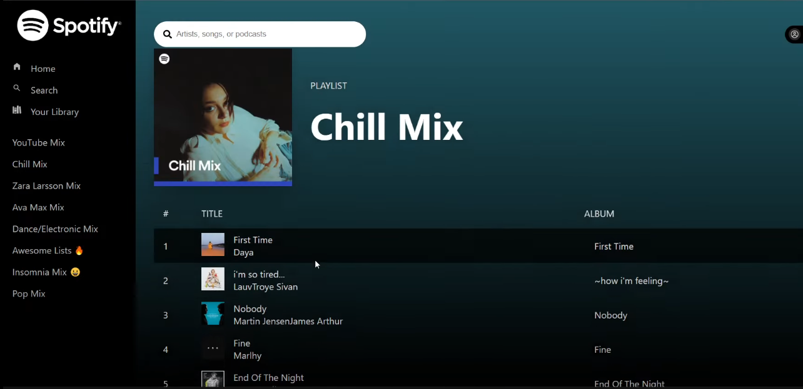

# Spotify Clone



This is a Spotify web app clone built with ReactJS and CSS. The app utilizes the Spotify API to fetch data from Spotify and uses Context API to manage global state of the application. Additionally, Redux Toolkit is used to efficiently manage the app state.

## Installation

First, you need to install Node.js and npm on your computer. Then, you can follow these steps to run this app locally:

1. Clone this repository:

```bash
git clone https://github.com/vuitinhvl7x/Spotify-clone.git
cd spotify-clone
npm install
npm start
```

The app will be running at [http://localhost:3000](http://localhost:3000).

## Features

- Login to Spotify account
- Display list of favorite songs and playlists
- Search for songs, albums, and artists
- Play music and control playback like Spotify
- Display detailed information about songs and artists

## Technologies Used

- ReactJS
- CSS
- Spotify API
- Context API
- Redux Toolkit
